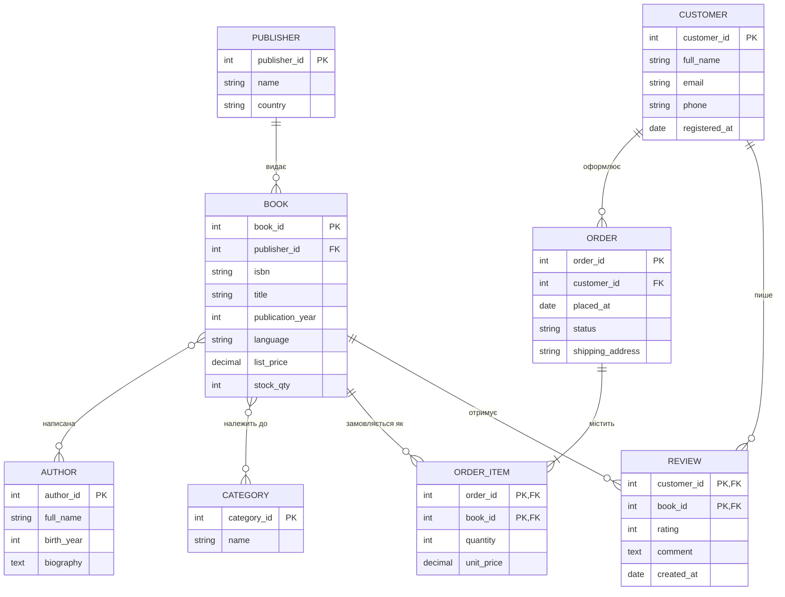

# Лабораторна 1 — Домен і ER-модель: онлайн-магазин книг

Домен: онлайн-магазин книг. Користувачі переглядають каталог, шукають книги за авторами й категоріями, оформлюють замовлення та залишають відгуки. У моделі є 1:N (видавець → книги), чисті M:N (книги ↔ автори, книги ↔ категорії) і зв'язок із власними атрибутами (замовлення ↔ книги через OrderItem).

## Структура репозиторію

| Файл | Призначення |
|---|---|
| `spec.md` | Сутності, атрибути, зв'язки словами; критерії прийняття AC1–AC8 |
| `erd.md` | ER-модель у декларативному синтаксисі Mermaid (рендер) |
| `adr/` | Ключові рішення (MADR) |
| `ai/01-er-prompt.md` | Задача для ШІ, за якою згенеровано модель, і аудит його виходу |
| `DEFENSE.md` | Захист: розбіжності, ADR, перевірка |

Фізичної схеми БД (SQL DDL, ORM) у репозиторії немає навмисно: це предмет курсу баз даних.

## Як це зроблено

1. Написано `spec.md` разом із критеріями прийняття.
2. ШІ згенерував `erd.md` за промптом із `ai/01-er-prompt.md` (ШІ використано, модель не ручна).
3. Аудит моделі проти `spec.md`; розбіжності виправлялися зміною spec/критеріїв з наступною перегенерацією, а не ручним патчем діаграми.

## ER-діаграма

Рендер ідентичний `er/er.mmd`.

