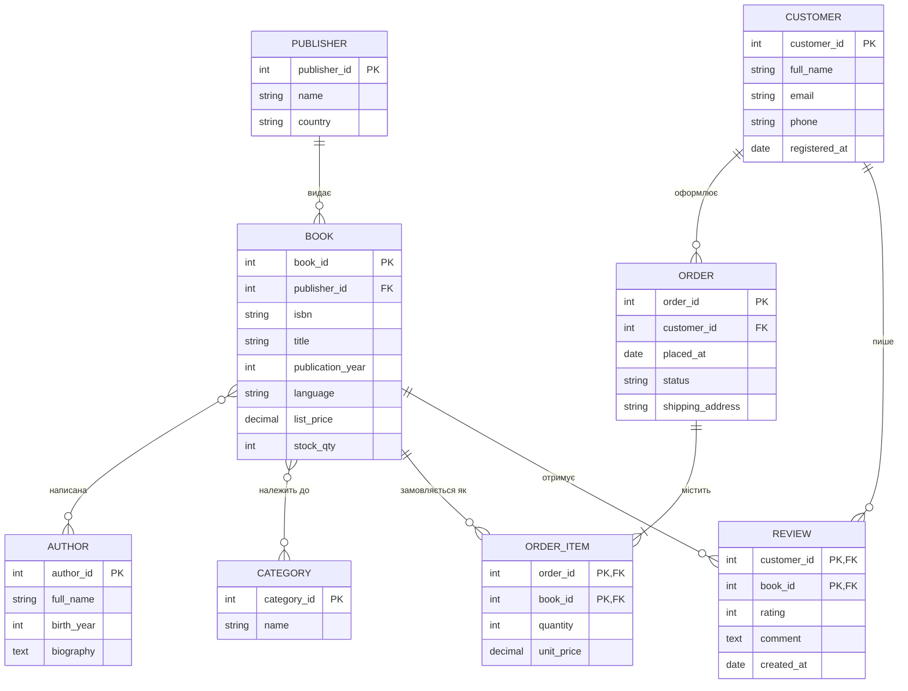

# Онлайн-магазин книг — ER-модель

Завдання 1: домен і модель даних (ER).

## Домен

Онлайн-магазин книг: каталог (книги, автори, видавництва, категорії), клієнти, замовлення з позиціями та відгуки. Домен обрано тому, що в ньому є всі типові випадки ER-моделювання: 1:N (видавництво → книги), чисте M:N (книги ↔ автори, книги ↔ категорії) і M:N із власними атрибутами (замовлення ↔ книги, клієнти ↔ книги через відгуки). Предметна область зрозуміла без додаткових пояснень.

## Структура репозиторію

| Файл | Призначення |
|---|---|
| `spec.md` | Сутності, атрибути, зв'язки словами; критерії прийняття AC-1…AC-10 |
| `er/er.mmd` | ER-модель у декларативному синтаксисі Mermaid |
| `docs/ai-prompt.md` | Задача для ШІ, за якою згенеровано модель |
| `DEFENSE.md` | Захист: розбіжності, ADR, перевірка |

Фізичної схеми БД (SQL DDL, ORM) у репозиторії немає навмисно: це предмет курсу баз даних.

## Як це зроблено

1. Написано `spec.md` разом із критеріями прийняття.
2. ШІ згенерував `er/er.mmd` за промтом із `docs/ai-prompt.md` (ШІ використано, модель не ручна).
3. Аудит моделі проти `spec.md`; розбіжності виправлялися зміною spec/критеріїв з наступною перегенерацією, а не ручним патчем діаграми.

## ER-діаграма

Рендер ідентичний `er/er.mmd`.

