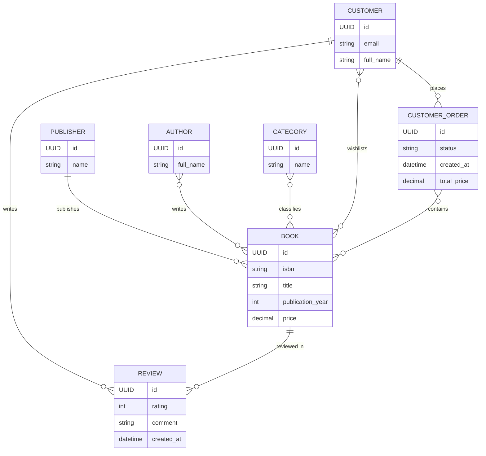

# Промпт 1 — початкова генерація (spec v1)

## Промпт
Згенеруй ER-діаграму у синтаксисі Mermaid (erDiagram) на основі цієї специфікації:

# Spec v1: онлайн-магазин книг (ER)

## Сутності, атрибути та зв'язки
- Customer: `id`, `email`, `full_name`.
  - Створює багато CustomerOrder (1:N). Пише багато Review (1:N).
  - Додає багато Book до списку бажаного (N:M).
- Publisher: `id`, `name`. Випускає багато Book (1:N).
- Author: `id`, `full_name`. Пише багато Book (N:M).
- Category: `id`, `name`. Класифікує багато Book (N:M).
- Book: `id`, `isbn`, `title`, `publication_year`, `price`.
  - Входить у багато CustomerOrder (N:M).
  - Має багато Review (1:N).
- CustomerOrder: `id`, `status`, `created_at`, `total_price` (сума замовлення).
- Review: `id`, `rating`, `comment`, `created_at`.

## Критерії прийняття
1. Усі `id` мають тип `UUID`.
2. Модель у 3NF.
3. Зв'язки N:M показані прямо між сутностями, без сполучних таблиць.
4. Формат — Mermaid `erDiagram`.

## Відповідь AI

## Аудит (spec ↔ вихід AI ↔ реляційна коректність)
Вихід формально відповідає критеріям v1, але при перевірці знайдено:
1. **Немає `PK`/`FK`.** Id без ключової позначки; у Book, CustomerOrder, Review немає полів зовнішніх ключів — зв'язки 1:N не відтворюються в атрибутах.
2. **`datetime`** замість `timestamp` (`created_at` ×2) — у spec тип часу не визначено.
3. **`CustomerOrder.total_price`** — похідне поле (сума по книгах), порушує 3NF (критерій 2); AI його відтворив, бо воно було у spec.
4. **Order–Book як прямий N:M** губить кількість і ціну на момент покупки — spec про них не згадує.

Виправлення — зміною spec, не ручним патчем: пункти 1–2 → prompt-2; пункти 3–4 → prompt-3.
