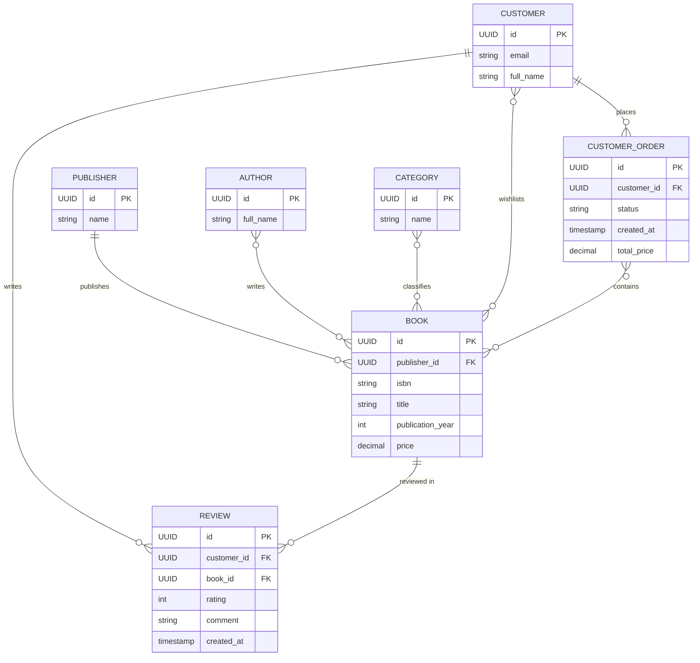

# Промпт 2 — PK, FK, timestamp (spec v2)

## Промпт
spec оновлено, тепер там нові критерії: 1 (UUID + обов'язково PK), 5 (FK на боці «багато» в 1:N), 6 (timestamp, не datetime). Згенеруй діаграму ще раз, врахуй усі критерії.

(те саме, що spec v1, змінено лише критерії)

## Критерії прийняття
1. Усі `id` мають тип `UUID` і обов'язково позначені `PK`.
2. Модель у 3NF.
3. Зв'язки N:M показані прямо між сутностями, без сполучних таблиць.
4. Формат — Mermaid `erDiagram`.
5. У зв'язках 1:N сутність на боці «багато» містить поле зовнішнього ключа з позначкою `FK`.
6. Поля з часом мають тип `timestamp`, не `datetime`.

## Відповідь AI

## Аудит
Пункти 1–2 з prompt-1 виправлені. Залишилось / нове:
1. **`total_price`** лишається в `CustomerOrder` — виходить за 3NF (spec вимагав його сам).
2. **Order–Book N:M без атрибутів зв'язку** — `quantity` і ціна на момент покупки не моделюються.
3. **Немає `UK`** для `email` і `isbn` — унікальність природних ключів не виражена.

Виправлення — зміною spec: критерій 2 (без похідних), критерій 3 (асоціативна сутність, коли зв'язок має власні атрибути), критерії 7 і 8 → prompt-3.
