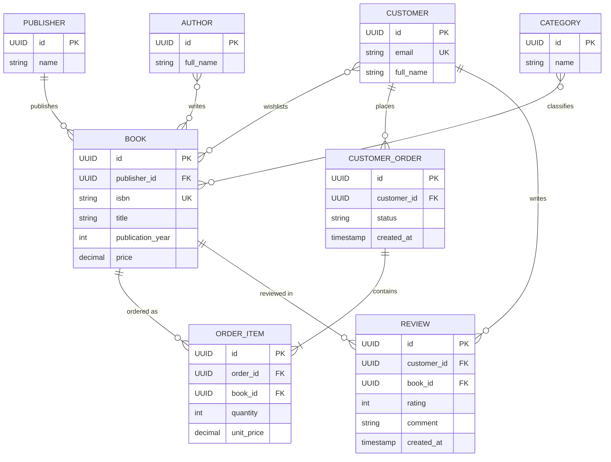

# Промпт 3 — похідні поля, OrderItem, UK (spec v3 = spec.md)

## Промпт
spec оновлено: з CustomerOrder прибрано `total_price`; додано сутність OrderItem; критерії 2 і 3 уточнено, додано 7 і 8. Згенеруй діаграму ще раз, врахуй усі критерії 1–8.

(повний текст — `spec.md` цього репозиторію)

## Відповідь AI

## Аудит
Усі розбіжності з prompt-1/2 закрито; перевірка по критеріях 1–8 — у `prompt-4.md`.
