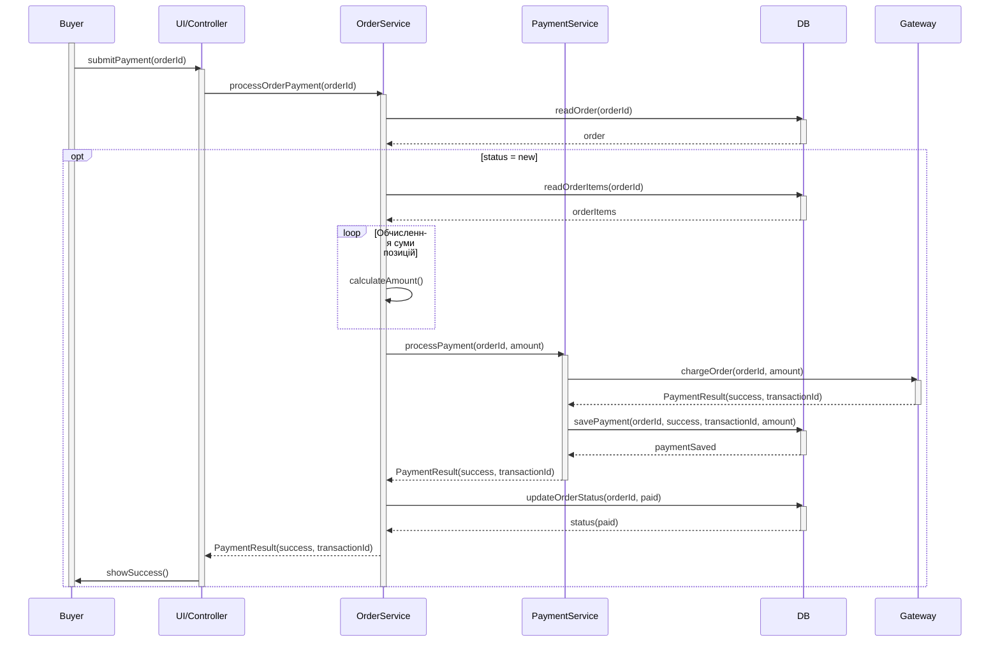

# SC-10 — Успішна оплата

```mermaid
sequenceDiagram
    participant Buyer
    participant UI as UI/Controller
    participant OS as OrderService
    participant PS as PaymentService
    participant DB
    participant GW as Gateway

    activate Buyer
    Buyer->>UI: submitPayment(orderId)
    activate UI
    UI->>OS: processOrderPayment(orderId)
    activate OS
    OS->>DB: readOrder(orderId)
    activate DB
    DB-->>OS: order
    deactivate DB

    opt status = new
        OS->>DB: readOrderItems(orderId)
        activate DB
        DB-->>OS: orderItems
        deactivate DB

        loop Обчислення суми позицій
            OS->>OS: calculateAmount()
        end

        OS->>PS: processPayment(orderId, amount)
        activate PS
        PS->>GW: chargeOrder(orderId, amount)
        activate GW
        GW-->>PS: PaymentResult(success, transactionId)
        deactivate GW

        PS->>DB: savePayment(orderId, success, transactionId, amount)
        activate DB
        DB-->>PS: paymentSaved
        deactivate DB

        PS-->>OS: PaymentResult(success, transactionId)
        deactivate PS

        OS->>DB: updateOrderStatus(orderId, paid)
        activate DB
        DB-->>OS: status(paid)
        deactivate DB

        OS-->>UI: PaymentResult(success, transactionId)
        UI->>Buyer: showSuccess()
    end

    deactivate OS
    deactivate UI
    deactivate Buyer
```