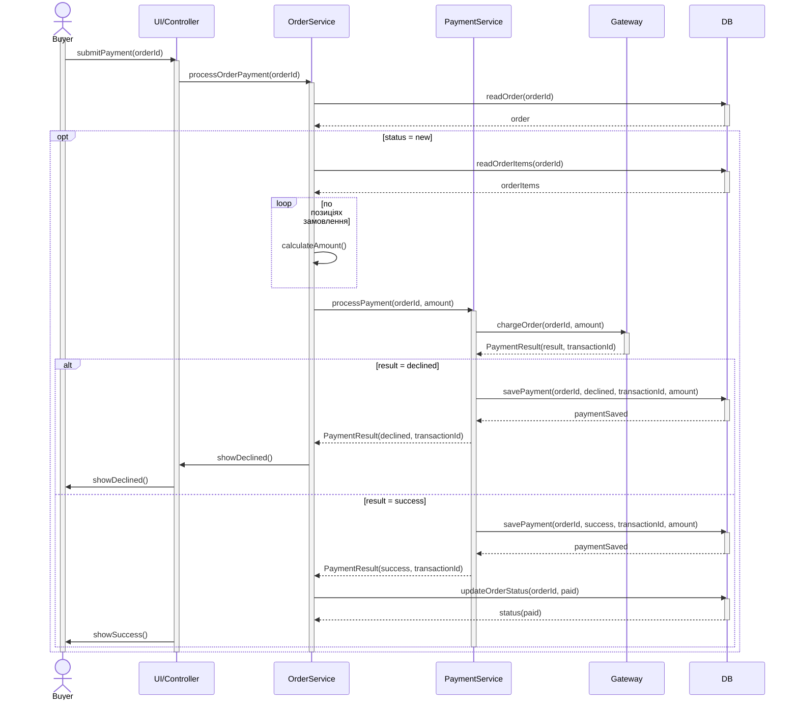

# SC-11 — Відмова в оплаті

```mermaid
sequenceDiagram
    actor Buyer
    participant UI as UI/Controller
    participant OS as OrderService
    participant PS as PaymentService
    participant GW as Gateway
    participant DB

    activate Buyer
    Buyer->>UI: submitPayment(orderId)
    activate UI
    UI->>OS: processOrderPayment(orderId)
    activate OS
    OS->>DB: readOrder(orderId)
    activate DB
    DB-->>OS: order
    deactivate DB

    opt status = new
        OS->>DB: readOrderItems(orderId)
        activate DB
        DB-->>OS: orderItems
        deactivate DB

        loop по позиціях замовлення
            OS->>OS: calculateAmount()
        end

        OS->>PS: processPayment(orderId, amount)
        activate PS
        PS->>GW: chargeOrder(orderId, amount)
        activate GW
        GW-->>PS: PaymentResult(result, transactionId)
        deactivate GW

        alt result = declined
            PS->>DB: savePayment(orderId, declined, transactionId, amount)
            activate DB
            DB-->>PS: paymentSaved
            deactivate DB

            PS-->>OS: PaymentResult(declined, transactionId)
            OS->>UI: showDeclined()
            UI->>Buyer: showDeclined()
        else result = success
            PS->>DB: savePayment(orderId, success, transactionId, amount)
            activate DB
            DB-->>PS: paymentSaved
            deactivate DB

            PS-->>OS: PaymentResult(success, transactionId)
            OS->>DB: updateOrderStatus(orderId, paid)
            activate DB
            DB-->>OS: status(paid)
            deactivate DB

            UI->>Buyer: showSuccess()
        end

        deactivate PS
    end

    deactivate OS
    deactivate UI
    deactivate Buyer
```