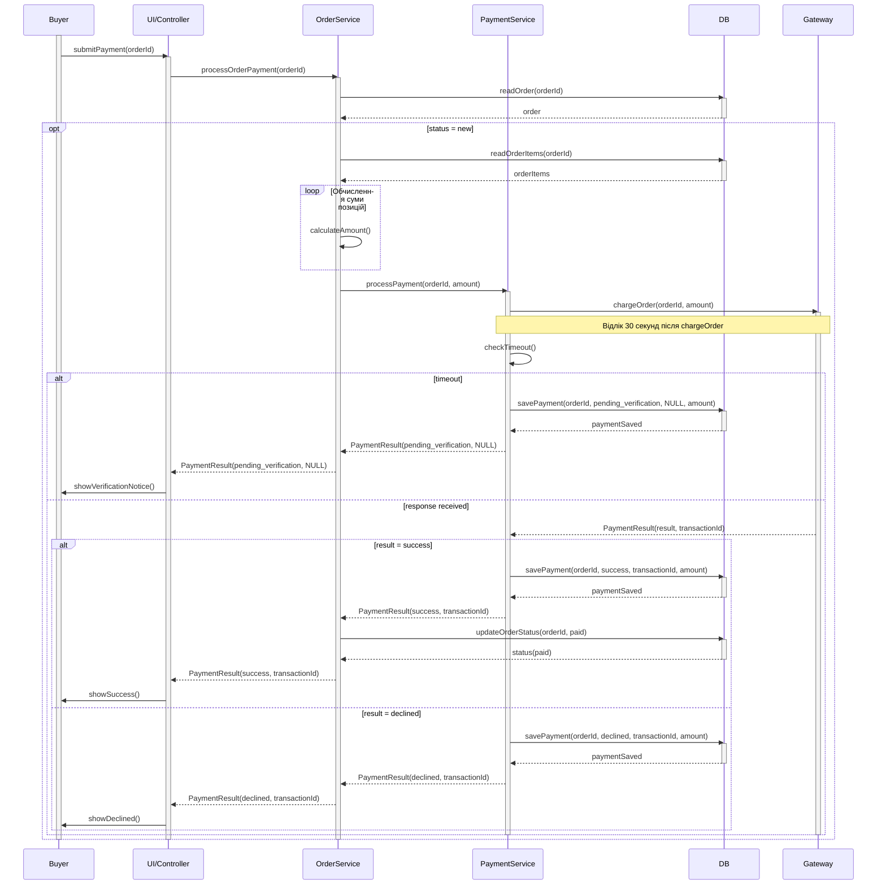

# SC-12 — Тайм-аут платіжного шлюзу

```mermaid
sequenceDiagram
    participant Buyer
    participant UI as UI/Controller
    participant OS as OrderService
    participant PS as PaymentService
    participant DB
    participant GW as Gateway

    activate Buyer
    Buyer->>UI: submitPayment(orderId)
    activate UI
    UI->>OS: processOrderPayment(orderId)
    activate OS
    OS->>DB: readOrder(orderId)
    activate DB
    DB-->>OS: order
    deactivate DB

    opt status = new
        OS->>DB: readOrderItems(orderId)
        activate DB
        DB-->>OS: orderItems
        deactivate DB

        loop Обчислення суми позицій
            OS->>OS: calculateAmount()
        end

        OS->>PS: processPayment(orderId, amount)
        activate PS
        PS->>GW: chargeOrder(orderId, amount)
        activate GW

        Note over PS,GW: Відлік 30 секунд після chargeOrder

        PS->>PS: checkTimeout()

        alt timeout
            PS->>DB: savePayment(orderId, pending_verification, NULL, amount)
            activate DB
            DB-->>PS: paymentSaved
            deactivate DB

            PS-->>OS: PaymentResult(pending_verification, NULL)
            OS-->>UI: PaymentResult(pending_verification, NULL)
            UI->>Buyer: showVerificationNotice()
        else response received
            GW-->>PS: PaymentResult(result, transactionId)

            alt result = success
                PS->>DB: savePayment(orderId, success, transactionId, amount)
                activate DB
                DB-->>PS: paymentSaved
                deactivate DB

                PS-->>OS: PaymentResult(success, transactionId)
                OS->>DB: updateOrderStatus(orderId, paid)
                activate DB
                DB-->>OS: status(paid)
                deactivate DB

                OS-->>UI: PaymentResult(success, transactionId)
                UI->>Buyer: showSuccess()
            else result = declined
                PS->>DB: savePayment(orderId, declined, transactionId, amount)
                activate DB
                DB-->>PS: paymentSaved
                deactivate DB

                PS-->>OS: PaymentResult(declined, transactionId)
                OS-->>UI: PaymentResult(declined, transactionId)
                UI->>Buyer: showDeclined()
            end
        end

        deactivate GW
        deactivate PS
    end

    deactivate OS
    deactivate UI
    deactivate Buyer
```