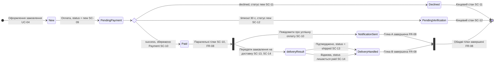

# Lab 4 — процес оплати (машина станів)

```mermaid
stateDiagram-v2
    direction LR

    [*] --> New : Оформлення замовлення UC-04
    New --> PendingPayment : Оплата, status = new SC-09

    state paymentResult <<choice>>
    PendingPayment --> paymentResult
    paymentResult --> Paid : success, збережено Payment SC-10
    paymentResult --> Declined : declined, статус new SC-11
    paymentResult --> PendingVerification : timeout 30 с, статус new SC-12

    Declined --> [*] : Кінцевий стан SC-11
    PendingVerification --> [*] : Кінцевий стан SC-12

    state forkPoint <<fork>>
    Paid --> forkPoint : Паралельні гілки SC-10, FR-08

    forkPoint --> NotificationSent : Повідомити про успішну оплату SC-10
    forkPoint --> deliveryResult : Передати замовлення на доставку SC-13, SC-14

    state deliveryResult <<choice>>
    deliveryResult --> DeliveryHandled : Підтверджено, status = shipped SC-13
    deliveryResult --> DeliveryHandled : Відмова, status лишається paid SC-14

    state joinPoint <<join>>
    NotificationSent --> joinPoint : Гілка A завершена FR-08
    DeliveryHandled --> joinPoint : Гілка B завершена FR-08

    joinPoint --> [*] : Обидві гілки завершені FR-08
```